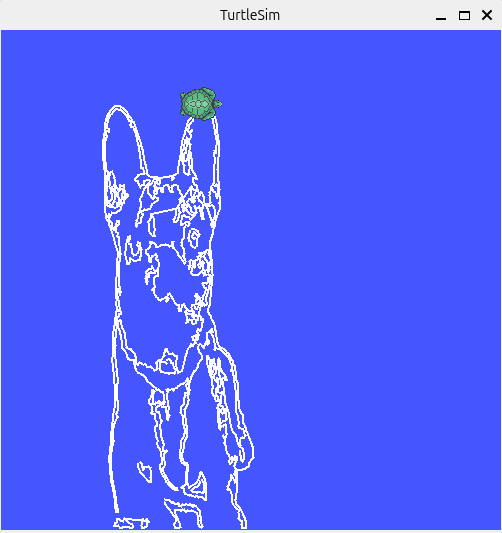

# Documentação Técnica: Turtle Draw

## Sumário

1. Visão Geral  
2. Detalhamento de Implementação  
   - 2.1 Pré-processamento  
   - 2.2 Detecção de Bordas  
   - 2.3 Planejamento de Caminho e Controle ROS 2  
3. Dificuldades Encontradas e Soluções  
4. Vídeo Demonstrativo  


# 1. Visão Geral

O projeto implementa uma pipeline completa que parte de uma imagem real de um cachorro e termina com a tartaruga do `turtlesim` desenhando o contorno desse cachorro na tela do simulador.



O fluxo foi dividido em duas etapas.
- **Etapa 1:** executada em um notebook Jupyter (`.ipynb`), realiza todo o processamento da imagem. Nessa fase são executadas as operações de conversão de cor, conversão para escala de cinza, suavização, detecção de bordas, operações morfológicas, extração de componentes conexos e geração da sequência final de pontos do contorno. O resultado final é armazenado em um arquivo `.npy`, contendo as coordenadas já preparadas para o ROS 2.

- **Etapa 2:** consiste no pacote ROS 2 `turtle_draw`, responsável por carregar os pontos extraídos e controlar a tartaruga do `turtlesim`, fazendo com que ela percorra os contornos identificados na imagem.

Uma restrição central da atividade foi que toda a inteligência de visão computacional precisou ser implementada manualmente. O OpenCV foi utilizado exclusivamente para carregar a imagem via `cv2.imread`. Todas as demais operações foram implementadas do zero utilizando apenas NumPy e estruturas manuais de processamento matricial.


# 2. Detalhamento de Implementação

## 2.1 Pré-processamento

### Carregamento da imagem

A imagem foi carregada utilizando:

```python
image = cv2.imread(path)
```

Como o OpenCV retorna imagens no formato BGR, foi necessário converter para RGB utilizando apenas NumPy:

```python
image = image[:, :, ::-1]
```

Essa abordagem substitui diretamente o `cv2.cvtColor`, cujo uso violaria as restrições da atividade.


### Conversão para escala de cinza

A imagem RGB foi convertida para escala de cinza utilizando a fórmula de luminância perceptiva:

```python
Y = 0.299·R + 0.587·G + 0.114·B
```

Essa formulação considera a sensibilidade do olho humano a cada canal de cor, produzindo uma representação mais adequada para detecção de bordas do que uma média aritmética simples.


### Suavização

Foi implementada manualmente uma convolução 2D utilizando um kernel de média 3x3.

O objetivo dessa etapa foi reduzir ruídos antes da aplicação do operador de Sobel, evitando que pequenas variações de intensidade fossem detectadas como bordas reais.

O padding utilizado foi do tipo `'edge'`, que replica os pixels da borda ao redor da imagem. Isso evitou bordas falsas que surgiriam caso fosse utilizado preenchimento com zeros.


## 2.2 Detecção de Bordas

### Operador de Sobel

A detecção de bordas foi realizada utilizando os kernels clássicos de Sobel:

```python
sobel_x = [[-1, 0, 1],
           [-2, 0, 2],
           [-1, 0, 1]]

sobel_y = [[-1, -2, -1],
           [ 0,  0,  0],
           [ 1,  2,  1]]
```

Os gradientes horizontais e verticais foram calculados separadamente e combinados pela magnitude euclidiana:

```python
G = sqrt(Gx² + Gy²)
```

Após isso, a magnitude foi normalizada para o intervalo `[0,255]`.


### Binarização

A imagem do gradiente foi convertida em imagem binária através de thresholding:

```python
binary = gradient > 30
```

O valor do threshold foi ajustado empiricamente. Valores muito baixos preservavam ruídos do fundo da imagem, enquanto valores muito altos removiam detalhes importantes do cachorro.


### Operações morfológicas

Foi aplicado fechamento morfológico manual:

1. Dilatação  
2. Erosão  

A dilatação conectou pequenos segmentos interrompidos das bordas. A erosão restaurou a espessura original após a expansão causada pela dilatação.

Ambas as operações foram implementadas manualmente utilizando janelas 3x3.


### Extração de componentes conexos

Inicialmente foi utilizado `cv2.findContours`, mas isso violava os requisitos da atividade.

A solução definitiva foi implementar um algoritmo próprio de componentes conexos utilizando DFS com 8-vizinhança.

A 8-vizinhança foi essencial para conectar pixels diagonais e evitar fragmentação excessiva dos contornos.

Além disso, componentes pequenos foram descartados como ruído:

```python
if len(component) < 50:
    continue
```

Depois da filtragem, os pontos foram reduzidos por amostragem para diminuir o número de chamadas do ROS 2.


## 2.3 Planejamento de Caminho e Controle ROS 2

### Mapeamento de coordenadas

Uma das etapas mais importantes foi converter coordenadas da imagem para o espaço do `turtlesim`.

O sistema de coordenadas da imagem possui origem no canto superior esquerdo e eixo Y crescendo para baixo. Já o `turtlesim` utiliza um sistema cartesiano tradicional, com origem inferior esquerda e eixo Y crescendo para cima.

A transformação final utilizada foi:

```python
turtle_x = (x / image_width) * 11.0
turtle_y = 11.0 - (y / image_height) * 11.0
```

Essa transformação normaliza os pontos para o espaço do simulador e inverte corretamente o eixo Y.


### Controle da tartaruga

A primeira abordagem utilizava `cmd_vel` com controle proporcional. O movimento era contínuo e baseado em velocidade linear e angular.

Na prática, isso gerava:
- oscilações;
- curvas indesejadas;
- acúmulo de erro angular;
- colisões nas paredes;
- perda de precisão.

A solução definitiva foi abandonar o controle por velocidade e utilizar o serviço:

```python
/turtle1/teleport_absolute
```

Com isso, a tartaruga passou a ser teleportada diretamente para cada ponto do contorno.

O desenho ficou muito mais estável e preciso.


### Controle da caneta

Outro serviço importante foi:

```python
/turtle1/set_pen
```

Esse serviço permitiu levantar e abaixar a caneta.

Inicialmente a tartaruga criava um risco reto do centro da tela até o primeiro ponto do desenho, porque a caneta já começava abaixada.

A solução foi:
1. levantar a caneta;
2. teleportar até o primeiro ponto;
3. abaixar a caneta apenas após o posicionamento inicial.


### Detecção de transições entre contornos

Outro problema ocorreu porque os pontos de contornos distintos estavam concatenados em sequência.

Sem tratamento, a tartaruga conectava:
- contorno externo;
- olhos;
- boca;
- nariz;

com linhas artificiais.

A solução foi calcular a distância euclidiana entre pontos consecutivos:

```python
dist = np.hypot(px - prev_x, py - prev_y)
```

Quando:

```python
dist > PEN_UP_THRESHOLD
```

o sistema interpreta que houve mudança de contorno:
1. levanta a caneta;
2. teleporta;
3. abaixa novamente.

Isso preservou corretamente a separação visual entre os elementos do cachorro.


# 3. Dificuldades Encontradas e Soluções

## 3.1 Diferença entre coordenadas de imagem e coordenadas do turtlesim

A maior dificuldade do projeto foi entender que o sistema de coordenadas da imagem era diferente do sistema de coordenadas utilizado pelo `turtlesim`.

Inicialmente os pontos extraídos foram enviados diretamente ao ROS 2. O resultado foi a tartaruga ultrapassando constantemente os limites da tela, gerando o erro:

```text
Oh no! I hit the wall!
```

A primeira hipótese foi que o problema estivesse apenas relacionado à escala dos pontos. Foi então aplicada uma normalização mais agressiva das coordenadas.

Apesar de reduzir parte das colisões, o problema persistiu.

Após observar visualmente o movimento da tartaruga, percebeu-se que o desenho estava invertido verticalmente. Nesse momento ficou claro que o eixo Y da imagem crescia em direção oposta ao eixo Y do `turtlesim`.

A solução definitiva exigiu:
- normalização para o intervalo do simulador;
- inversão completa do eixo Y.

Somente após essa transformação o desenho passou a caber corretamente dentro da área do `turtlesim`.


## 3.2 Extração dos pontos do contorno

Outra grande dificuldade foi produzir uma sequência de pontos suficientemente limpa para ser percorrida pela tartaruga.

As primeiras versões da pipeline preservavam muito ruído do fundo:
- sombras;
- textura do chão;
- objetos do cenário;
- pequenas variações de iluminação.

A primeira tentativa foi aumentar o threshold da binarização. Isso removeu parte dos ruídos, mas também apagou olhos, boca e detalhes internos do cachorro.

A segunda tentativa foi aumentar a suavização da imagem. O ruído diminuiu, mas partes do contorno externo também começaram a desaparecer.

A solução definitiva combinou:
- suavização moderada;
- threshold calibrado empiricamente;
- fechamento morfológico;
- filtragem por tamanho mínimo de componente conexo.

Essa combinação preservou os detalhes relevantes do cachorro enquanto eliminava grande parte do fundo.


## 3.3 Problemas de movimentação da tartaruga

Inicialmente a movimentação era feita utilizando `cmd_vel`.

Na prática:
- a tartaruga fazia curvas;
- acumulava erro angular;
- oscilava;
- desenhava trajetórias imprecisas.

Além disso, havia um risco reto do centro da tela até o primeiro ponto do desenho.

A primeira tentativa foi apenas diminuir a velocidade inicial da tartaruga. Isso não resolveu o problema, porque a linha continuava sendo desenhada independentemente da velocidade.

Ao estudar os serviços do `turtlesim`, foi encontrado o `SetPen`, que permitia levantar a caneta.

A solução foi:
1. levantar a caneta;
2. mover a tartaruga;
3. abaixar novamente após alcançar o ponto inicial.

Isso eliminou completamente o risco inicial.


### Linhas artificiais entre partes do cachorro

Mesmo após resolver o risco inicial, a tartaruga ainda conectava partes diferentes do cachorro com linhas artificiais.

O problema ocorria porque:
- todos os pontos estavam em sequência;
- a caneta permanecia abaixada o tempo inteiro.

A primeira ideia foi reorganizar manualmente os pontos, mas isso rapidamente se mostrou inviável devido à quantidade de coordenadas.

A solução final foi detectar automaticamente transições entre contornos através da distância entre pontos consecutivos.

Quando dois pontos estavam muito distantes:
- a caneta era levantada;
- a tartaruga teleportava;
- a caneta era abaixada novamente.


### Substituição de `cmd_vel` por `TeleportAbsolute`

Mesmo após resolver os riscos artificiais, o controle por velocidade ainda gerava imprecisões.

A solução definitiva foi substituir completamente o controle contínuo por teleporte utilizando:

```python
/turtle1/teleport_absolute
```

Essa mudança eliminou:
- acúmulo de erro;
- curvas indesejadas;
- oscilações;
- colisões.

A tartaruga passou a desenhar exatamente nos pontos calculados pela pipeline.


# 4. Vídeo Demonstrativo

Acesse [aqui](https://drive.google.com/file/d/1QoPpqOmEGjQ4dgC0SpbZ0XcjbMnQ9VtB/view?usp=sharing) o vídeo demonstrativo.